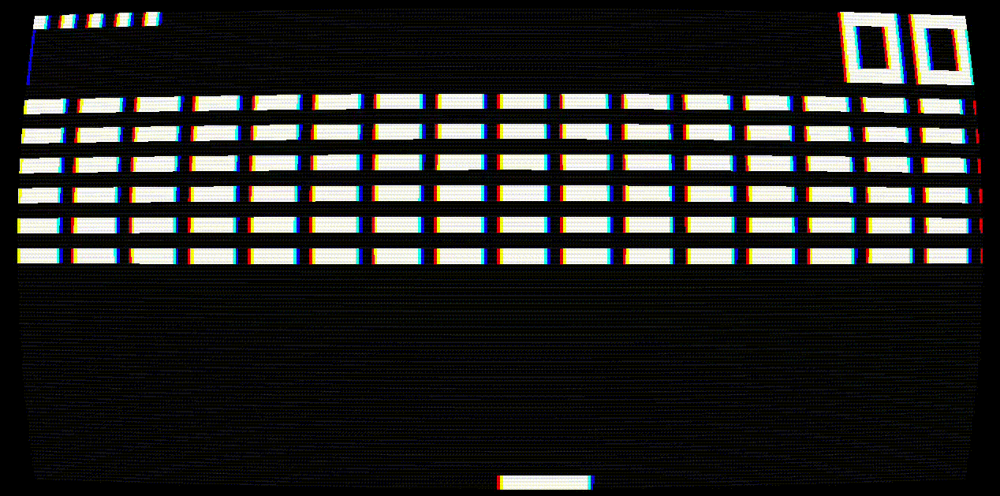

# CHIP-8 Emulator
CHIP-8 and SUPER CHIP-8 emulator developed in **C** using **Raylib**.

## Table of Contents
- [Requirements](#requirements)
- [Installation](#installation)
- [Usage](#usage)
- [Controls](#controls)

## Requirements
* **CMake 3.12+**
* **GCC**
* **Raylib**: Manual installation is not required; the `CMakeLists.txt` automatically downloads it from the official repository during configuration.

## Installation
1. `git clone https://github.com/jonathan-bug/chip-8-emulator.git`
2. `cd chip-8-emulator`
3. `cmake -S . -B build`
4. `cmake --build build`
>[!IMPORTANT]
>The build process will generate the `chip-8-emulator`executable in `./build/`and automatically copy the `./resources/` folder to that directory to ensure portability and correct operation.

## Usage
To ensure the emulator loads games and resources correctly, you must run it from the build folder:

1. `cd build`
2. `./chip-8-emulator [ROM_NAME] [FLAGS]`

### Flags
Flags determine the behavior of the emulator.

|Flag|Description|Default|
|-|-|-|
|`-q <n>`|**Quirks** configuration using a decimal number (bits)|`-q 35`|
|`-f <n>`|Determines the number of instructions per frame (60fps)|`-f 16`|
|`-t <n>`|Determines if the ROM is a binary (`0`) or text (`1`)|`-t 0`|
|`<name>`|Name of the ROM inside `./resources/games/`|Default ROM|

**Examples:**
* `./chip-8-emulator` (Uses default flags)
* `./chip-8-emulator ROM.ch8` (Loads the specified ROM)
* `./chip-8-emulator -t 1 ROM.txt` (Loads instructions from a text file)

### Quirks
Quirks determine how CHIP-8 instructions behave. The configuration is obtained by applying a bitmask.

|Quirk|35 (CHIP-8)|84 (SUPER CHIP-8)|86 (SUPER CHIP-8 MODERN)|Mask (n)|
|-|-|-|-|-|
|shift|0|1|1|`n & 64`|
|increase I by VX|1|0|0|`n & 32`|
|do not increase I|0|1|1|`n & 16`|
|wrap|0|0|0|`n & 08`|
|jump|0|1|1|`n & 04`|
|v-blank|1|0|1|`n & 02`|
|logic|1|0|0|`n & 01`|

**Common Configurations:**
- CHIP-8 `-q 35`
- SUPER CHIP-8 `-q 84`
- SUPER CHIP-8 MODERN `-q 86`

## Controls
The key layout for the emulator is:
|CHIP-8|Keyboard|
|-|-|
|`1 2 3 C`|`1 2 3 4`|
|`4 5 6 D`|`Q W E R`|
|`7 8 9 E`|`A S D F`|
|`A 0 B F`|`Z X C V`|

**Utilities**
* **Space**: Enable/Disable shader
* **CTRL**: Reload ROM